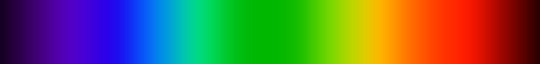

* Blah
{:toc}

# You've seen this picture, and it's wrong.

[^1]

[^1]: Copied from "[Colorful spectrum
    simulation](https://commons.wikimedia.org/wiki/File:Spectrum4websiteEval.png)"
    on Wikimedia Commons, created by Deborah S. Krolls,December
    13, 2004.  Labeled as both "all permissions granted by originator"
    and CC BY-SA 3.0 Unported in different places on the Wikimedia
    details page.  To be clear, I'm _not_ saying that this image is
    wrong in the context for which the creator intended it, just that
    it's not a realistic depiction of color as perceived by humans.

  
# About
My name is [Eric Anderson](http://www.cs.cmu.edu/~andersoe), and I wrote this in an attempt to add a little bit of technical nuance to the discussion of network neutrality.  I am a computer scientist, but this is not my area of expertise within the field.  (Update:  I wrote this in 2014, when I was CMU faculty.  I moved to a government position in 2016, but these are my own personal thoughts and not those of my employer).

# Notes

Footnotes will appear here.
